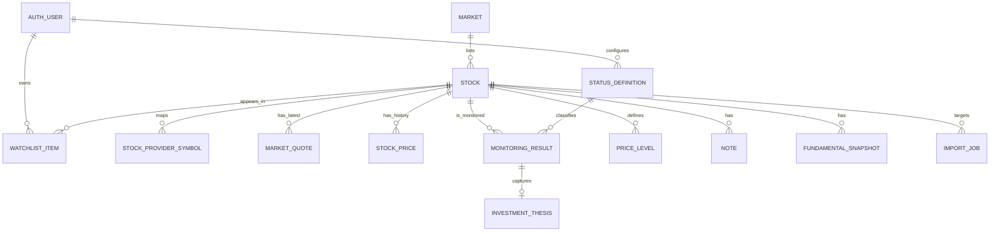
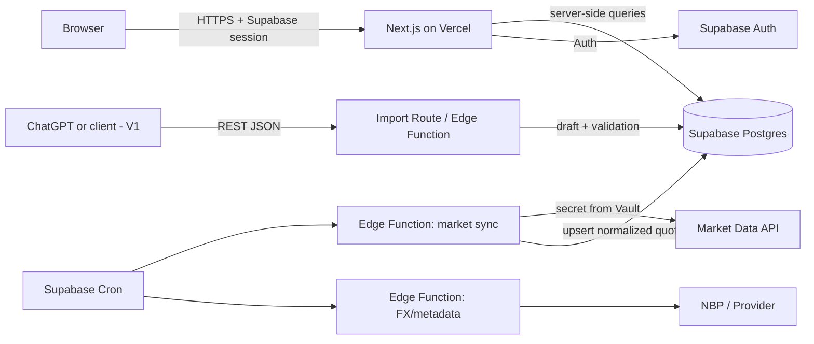

# PRD: Stock Monitor GPW + USA

**Wersja:** 1.0  
**Data:** 30.08.2026  
**Status:** gotowy do implementacji MVP  
**Właściciel produktu i jedyny użytkownik:** inwestor indywidualny  
**Nazwa robocza:** Stock Monitor / Investment Research Hub

> Dokument opisuje prywatne narzędzie badawcze, a nie system transakcyjny. Dane rynkowe mogą być opóźnione lub błędne i nie są poradą inwestycyjną. Aplikacja nie może sugerować, że prezentowane ceny są real-time, jeśli dostawca tego nie gwarantuje.

## Decyzje wiążące

1. **Architektura:** Next.js (React + TypeScript) na Vercel + Supabase (PostgreSQL, Auth, Row Level Security, Cron/Edge Functions).
2. **Dane rynkowe MVP:** adapter do EODHD; plan `EOD+Intraday — All World Extended` jako rekomendowany wariant płatny. Obsługuje GPW (`WAR`, np. `PZU.WAR`) i USA w jednym API. Aplikacja musi pozwalać uruchomić MVP także bez klucza dostawcy, z cenami wprowadzanymi ręcznie.
3. **Dane fundamentalne:** poza MVP; w V1 przez drugi adapter i osobną subskrypcję dopiero po sprawdzeniu pokrycia na reprezentatywnej próbce spółek.
4. **Częstotliwość cen:** co 30 minut w czasie sesji; odległości od poziomów są obliczane przy odczycie, a nie osobnym zadaniem.
5. **Statusy:** edytowalne przez użytkownika. Domyślne statusy są seedem danych, nie enumem zaszytym w interfejsie.
6. **Historia:** wyniki monitoringu i wersje thesis są niezmienne; korekta tworzy nową rewizję albo jawnie oznaczoną poprawkę, nigdy ciche nadpisanie.
7. **MVP:** watchlista, klasyfikacja, ceny, poziomy, monitoring history, notatki, dashboard i ręczny formularz. Import JSON, fundamenty, alerty oraz portfolio są V1/V2.

---

## 1. Executive Summary

Stock Monitor jest prywatną aplikacją desktop-first, która porządkuje monitoring spółek z GPW i rynku USA. Jej głównym zadaniem jest odpowiedzieć w mniej niż minutę na trzy pytania:

1. Które spółki są dziś najciekawsze?
2. Jak daleko ich aktualna cena znajduje się od zaplanowanych poziomów zakupu?
3. Jak i dlaczego zmieniała się ocena spółki w czasie?

Produkt łączy watchlistę, opóźnione dane rynkowe, elastyczne statusy, poziomy cenowe, historię monitoringów, thesis i notatki. Nie jest terminalem giełdowym ani systemem do handlu. Wartością produktu jest pamięć procesu inwestycyjnego oraz szybkie priorytetyzowanie pracy analitycznej.

MVP ma być małym monolitem webowym z zarządzaną bazą i autoryzacją. Nie powstaje osobny backend ASP.NET Core. Integracje z zewnętrznymi API są zamknięte w adapterach po stronie serwera, aby można było wymienić dostawcę bez przebudowy domeny i UI.

### Mierniki powodzenia MVP

- dodanie spółki i pierwszego monitoringu zajmuje nie więcej niż 3 minuty;
- dashboard ładuje użyteczne dane w mniej niż 2 sekundy przy 100 spółkach (P95, bez czasu zimnego startu zewnętrznego API);
- każda obserwowana spółka ma widoczną świeżość ceny i źródło danych;
- użytkownik może w mniej niż 30 sekund znaleźć spółki oddalone maksymalnie o 10% od poziomu zakupu;
- utworzenie nowego monitoringu nie usuwa ani nie modyfikuje poprzedniego;
- przy awarii dostawcy nadal można otworzyć aplikację, przeglądać historię i wprowadzić cenę ręcznie.

## 2. Problem Statement

Wyniki analiz są rozproszone między rozmowami, dokumentami i notatkami. Brakuje jednego kanonicznego miejsca, które łączy:

- aktualny stan watchlisty;
- ostatnią decyzję i jej uzasadnienie;
- cenę rynkową oraz planowane poziomy wejścia;
- historię zmian oceny, thesis i ryzyka;
- wyniki analiz GPW i USA w porównywalnym formacie.

Skutkiem są powtarzane analizy, trudność w odtworzeniu wcześniejszych założeń oraz ryzyko przeoczenia ceny, na którą wcześniej czekano. Standardowe aplikacje portfelowe rozwiązują głównie problem wyceny pozycji, a nie pamięci procesu badawczego.

## 3. Product Vision

Jedno spokojne, gęste informacyjnie centrum pracy inwestora długoterminowego: rano lub po sesji użytkownik otwiera dashboard, widzi najbliższe okazje, sprawdza kontekst i aktualizuje monitoring bez szukania poprzednich materiałów.

Produkt ma przypominać lekkie narzędzie analityczne inspirowane Koyfin, TIKR i profesjonalnymi terminalami, ale jego domena kończy się na własnej watchliście i historii decyzji.

## 4. Goals

### G1. Jedna prawda o watchliście

Każda spółka ma jednoznaczną tożsamość (`market + ticker`), aktualny status, cenę i datę ostatniego monitoringu.

### G2. Priorytetyzacja okazji

Dashboard porządkuje spółki według statusu, Investment Score i odległości od aktywnego poziomu zakupu.

### G3. Zachowanie historii decyzji

Monitoring jest zdarzeniem w czasie, zawierającym cenę, wyniki, rekomendację, komentarz i opcjonalną rewizję thesis.

### G4. Plan zakupu w kontekście ceny

Poziomy `Fair Value`, `Strong Buy` i dowolne transze są konfigurowalne, uporządkowane i czytelnie porównane z ostatnią ceną.

### G5. Przygotowanie pod AI

Model domenowy i API przyjmują ustrukturyzowane wyniki analizy, ale MVP nie uzależnia się od modelu AI ani jednego promptu.

### G6. Niski koszt i niska złożoność

Jedno repozytorium, jeden język aplikacji, zarządzana baza, brak stale działającego serwera oraz możliwość startu na darmowych planach poza dostawcą danych.

## 5. Non-Goals

W MVP i V1 nie należy budować:

- funkcji społecznościowych, komentarzy wielu osób ani publicznych profili;
- płatności, subskrypcji i monetyzacji;
- integracji brokerskiej, składania zleceń lub kopiowania transakcji;
- danych tick-by-tick, order booka, streamingu websocket i tradingu intraday;
- algorytmów tradingowych i automatycznych rekomendacji kup/sprzedaj;
- rozbudowanego zarządzania rolami i organizacjami;
- natywnej aplikacji mobilnej;
- pełnego screenera całego rynku;
- księgowości podatkowej;
- generowania wycen DCF przez aplikację;
- hurtowego archiwum raportów giełdowych;
- własnego systemu e-mail/push w MVP.

## 6. Target User

### Primary persona: inwestor długoterminowy

- jedna osoba;
- analizuje GPW i spółki amerykańskie;
- pracuje głównie na desktopie;
- przegląda od kilkudziesięciu do około 200 spółek;
- wykonuje monitoring okresowo, a nie stale;
- akceptuje ceny opóźnione o 15–30 minut i fundamenty dzienne;
- używa ChatGPT do części analiz;
- oczekuje kontroli nad statusem, thesis i decyzją końcową.

### Założenia wolumenowe

| Wymiar | Założenie projektowe |
|---|---:|
| Aktywne spółki | 20–200 |
| Monitoring results / spółkę / rok | 2–24 |
| Poziomy cenowe / spółkę | 0–10 |
| Notatki / spółkę | 0–100 |
| Aktualizacje ceny | do 2/h w czasie sesji |
| Użytkownicy | 1 |

## 7. Core User Flows

### Flow A — dodanie spółki

1. Użytkownik wybiera `Add stock`.
2. Wpisuje ticker lub nazwę i wybiera rynek GPW/USA.
3. System normalizuje ticker oraz wyszukuje metadane u dostawcy.
4. Użytkownik potwierdza właściwy instrument.
5. System tworzy `Stock` i `WatchlistItem`, pobiera pierwszą cenę i otwiera ekran spółki.
6. Jeśli dostawca nie znajdzie symbolu, możliwe jest utworzenie ręczne z ostrzeżeniem `manual data`.

### Flow B — szybki poranny/przedwieczorny przegląd

1. Użytkownik otwiera `/dashboard`.
2. Widzi liczniki GPW/USA, Opportunities i Near Buy Zone.
3. Filtruje rynek lub status.
4. Otwiera spółkę, sprawdza thesis, ryzyka i poprzedni monitoring.
5. Dodaje monitoring lub notatkę.

### Flow C — aktualizacja monitoringu

1. Na stronie spółki użytkownik wybiera `New monitoring`.
2. Formularz wstępnie wypełnia bieżącą cenę, walutę i poprzedni status.
3. Użytkownik ustawia wyniki, status, rekomendację, argumenty i ryzyka.
4. Dla USA system proponuje bieżący USD/PLN; użytkownik może go poprawić.
5. Podgląd pokazuje zmianę względem poprzedniego monitoringu.
6. Po zatwierdzeniu zapisuje się niezmienny wpis historii i aktualizuje status bieżący spółki.

### Flow D — ustawienie poziomów

1. Użytkownik dodaje nazwę, wartość, typ (`buy`, `fair_value`, `sell`, `custom`) i warunek osiągnięcia.
2. UI waliduje dodatnią wartość i walutę zgodną z notowaniem.
3. Po zapisaniu ekran pokazuje dystans procentowy i stan `reached/not reached`.

### Flow E — przyszły import AI

1. Użytkownik wkleja JSON lub klient wywołuje `POST /api/v1/monitoring-imports`.
2. Serwer waliduje schemat, ticker, rynek i zakresy danych.
3. Powstaje draft z listą ostrzeżeń i różnic.
4. Użytkownik zatwierdza draft.
5. Dopiero zatwierdzenie tworzy monitoring, thesis i poziomy.

## 8. Functional Requirements

| ID | Wymaganie | Priorytet | Etap |
|---|---|---|---|
| FR-001 | Logowanie jednego użytkownika | Must | MVP |
| FR-002 | CRUD watchlisty GPW/USA | Must | MVP |
| FR-003 | Wyszukiwanie, filtrowanie i sortowanie | Must | MVP |
| FR-004 | Automatyczna i ręczna cena ze świeżością danych | Must | MVP |
| FR-005 | Edytowalne statusy | Must | MVP |
| FR-006 | Niezmienna historia monitoringów | Must | MVP |
| FR-007 | Konfigurowalne poziomy cenowe i dystans | Must | MVP |
| FR-008 | Dashboard Opportunities/Near Buy Zone | Must | MVP |
| FR-009 | Thesis, ryzyka, kill criteria | Must | MVP |
| FR-010 | Notatki i przypinanie | Must | MVP |
| FR-011 | Kurs USD/PLN w monitoringu USA | Should | MVP |
| FR-012 | Import JSON jako draft | Should | V1 |
| FR-013 | Fundamental snapshots | Should | V1 |
| FR-014 | Alerty cenowe | Could | V1 |
| FR-015 | Portfolio i wyniki | Could | V2 |

### Wymagania przekrojowe

- Wszystkie daty w bazie są przechowywane w UTC, a UI prezentuje je w `Europe/Warsaw`.
- Wszystkie wartości pieniężne używają `numeric`, nie `float`.
- Każda cena pokazuje `as of`, źródło i stan świeżości.
- Brak danych jest odróżniony od zera.
- Mutacje zwracają czytelne błędy walidacji i nie zapisują częściowego stanu.
- Interfejs pozostaje użyteczny przy niedostępności zewnętrznego API.

## 9. Watchlist

### User stories

- Jako inwestor chcę dodać ticker i rynek, aby rozpocząć jego monitoring.
- Jako inwestor chcę filtrować według rynku, statusu i odległości od ceny zakupu, aby skupić się na okazjach.
- Jako inwestor chcę usunąć spółkę z aktywnej watchlisty bez kasowania historii.
- Jako inwestor chcę wyszukiwać po tickerze i nazwie.

### Zachowanie

- Unikalność instrumentu: `(market_id, normalized_ticker)`.
- GPW i USA są osobnymi rynkami; `PZU` i `PZU.WAR` mapują się do jednego instrumentu GPW.
- Usunięcie oznacza `WatchlistItem.archived_at`, nie usunięcie `Stock`.
- Ponowne dodanie przywraca istniejący wpis wraz z historią.
- Sortowania MVP: ticker, nazwa, cena, daily change, Investment Score, status, last monitored, distance to nearest buy level.
- Filtry MVP: rynek, status, `near buy zone`, `stale price`, brak monitoringu.
- Wyszukiwanie po stronie bazy przez `ILIKE` jest wystarczające dla zakładanej skali.

### Acceptance criteria

- AC-WL-01: dodanie `PZU`/GPW tworzy jeden rekord, a druga próba nie tworzy duplikatu.
- AC-WL-02: ticker USA i GPW mogą mieć taki sam tekst, ponieważ rynek jest częścią klucza.
- AC-WL-03: archiwizacja nie usuwa monitoringu, thesis, poziomów ani notatek.
- AC-WL-04: filtr i sortowanie mogą działać jednocześnie, a stan filtrów jest zapisany w URL.
- AC-WL-05: tabela wskazuje ceny starsze niż próg świeżości.
- AC-WL-06: przy braku dopasowania dostawcy użytkownik może anulować lub dodać instrument manualny.

## 10. Stock Monitoring

`MonitoringResult` jest migawką decyzji w konkretnym momencie. Nie należy traktować go jako edytowalnego profilu spółki.

### Pola

- `analyzed_at` — data i czas analizy;
- `status_definition_id`;
- `investment_score`, `quality_score`, `valuation_score`, `momentum_score`, `risk_score` — opcjonalne `0..100`;
- `recommendation` — krótki tekst lub edytowalna etykieta;
- `summary`;
- `pros[]`, `risks[]` — tablice krótkich punktów;
- `price`, `currency`, `price_as_of`;
- `fx_usd_pln`, `price_pln` dla USD;
- `source_type` — `manual | json_import | api_import`;
- `source_reference` — opcjonalny identyfikator rozmowy/dokumentu;
- `created_at`, `supersedes_id`.

### Reguły

- Wyniki `0` są prawidłowe; brak wyniku to `NULL`.
- `Investment Score` może być wpisany ręcznie. Aplikacja nie wylicza go automatycznie w MVP.
- `risk_score`: większa liczba zawsze oznacza **lepszy profil / niższe ryzyko**. UI nazywa pole `Risk safety`, aby uniknąć odwróconej interpretacji.
- Cena z analizy nie zmienia się po późniejszej aktualizacji rynku.
- Jeśli użytkownik poprawia pomyłkę, nowy rekord wskazuje `supersedes_id`; poprzedni pozostaje w historii z oznaczeniem `superseded`.
- Bieżący status watchlisty jest denormalizowany w `WatchlistItem.current_status_id` w tej samej transakcji, ale źródłem audytowym pozostaje ostatni aktywny monitoring.

### Acceptance criteria

- AC-MON-01: zapis monitoringu tworzy nowy rekord i nie wykonuje `UPDATE` poprzedniego.
- AC-MON-02: wszystkie score są puste albo należą do `0..100`.
- AC-MON-03: dla ceny USD podanie kursu wylicza `price_pln = price * fx_usd_pln` z dokładnością do 2 miejsc tylko do prezentacji; baza zachowuje większą precyzję.
- AC-MON-04: formularz pokazuje różnicę statusu, ceny i score względem poprzedniego wpisu.
- AC-MON-05: zapis thesis i monitoringu jest atomowy.

## 11. Stock Classification

Statusy są rekordami w `StatusDefinition`, a nie enumem domenowym. Seed startowy:

| Klucz startowy | Etykieta | Dashboard group | Znaczenie |
|---|---|---|---|
| `BUY_CANDIDATE` | Buy Candidate | opportunity | atrakcyjna fundamentalnie i cenowo |
| `WATCH` | Watch | watch | dobra, lecz bez marginesu bezpieczeństwa |
| `WAIT_FOR_CORRECTION` | Wait for Correction | watch | oczekiwanie na niższą cenę |
| `DEEP_DIVE` | Deep Dive | research | wymaga pełnej analizy |
| `PORTFOLIO` | Portfolio | portfolio | znajduje się w portfelu |
| `HOLD` | Hold | portfolio | pozycja bez potrzeby zwiększenia |
| `AVOID` | Avoid | negative | obecnie niespełniająca kryteriów |
| `KILL_THE_THESIS` | Kill the Thesis | negative | thesis została naruszona |

### Edycja statusów

Użytkownik może zmienić nazwę, kolor, kolejność, opis i grupę dashboardową oraz tworzyć nowe statusy. Statusu użytego historycznie nie można usunąć; można go dezaktywować. Stabilne ID zachowuje historię nawet po zmianie etykiety. Przy eksporcie zapisywane są ID i bieżący `slug`.

### Rozdzielenie statusu i zdarzenia

`TRANCHE 1 REACHED` nie powinno domyślnie być statusem spółki. Osiągnięcie transzy jest stanem poziomu cenowego. Dzięki temu klasyfikacja jakościowa nie miesza się z mechanicznym sygnałem ceny.

## 12. Price Levels

### Model poziomu

- `label` — np. `Tranche 1`, `Strong Buy`, `Fair Value`;
- `kind` — `buy | fair_value | sell | custom`;
- `value`, `currency`;
- `trigger_direction` — `lte` (osiągnięty, gdy cena ≤ poziom) lub `gte`;
- `priority` i `sort_order`;
- `is_active`;
- `valid_from`, `valid_to` — przygotowanie pod historię zmian;
- opcjonalne `note`.

### Obliczenia

```text
distancePct = ((levelValue - currentPrice) / currentPrice) * 100

reached(lte) = currentPrice <= levelValue
reached(gte) = currentPrice >= levelValue
```

Przykład dla `current = 475`:

| Poziom | Wartość | Dystans | Stan dla `lte` |
|---|---:|---:|---|
| Tranche 1 | 500 | +5,3% | reached |
| Tranche 2 | 460 | -3,2% | 3,2% poniżej bieżącej ceny |
| Tranche 3 | 420 | -11,6% | 11,6% poniżej bieżącej ceny |

W UI należy dodatkowo użyć opisu słownego, ponieważ sam znak procentu bywa niejednoznaczny. `Near Buy Zone` obejmuje aktywne poziomy `kind=buy`, które nie zostały osiągnięte i wymagają spadku nie większego niż konfigurowalny próg, domyślnie 10%. Osiągnięte poziomy są pokazywane osobno jako `Reached`.

### Acceptance criteria

- AC-PL-01: poziom ma wartość dodatnią i walutę zgodną z instrumentem.
- AC-PL-02: dystans dla 475 → 460 wynosi po zaokrągleniu `-3,2%`.
- AC-PL-03: poziom `lte=500` jest osiągnięty przy cenie 475.
- AC-PL-04: zmiana ceny odświeża dystans bez zapisu do bazy.
- AC-PL-05: dezaktywowany poziom nie trafia do Near Buy Zone.
- AC-PL-06: zmiana wartości poziomu zamyka starą wersję i tworzy nową, jeśli historia poziomów jest włączona; w uproszczonym MVP dozwolona jest edycja in-place z wpisem w `AuditEvent`.

## 13. Monitoring History

Historia jest osią czasu sortowaną malejąco po `analyzed_at`. Każda karta pokazuje:

- datę, status i cenę;
- score i zmianę względem poprzedniego wpisu;
- skrót komentarza;
- zmianę thesis/ryzyk;
- źródło (`manual`, `AI import`);
- link do pełnych szczegółów.

Widok `Compare` w V1 zestawia dowolne dwa wpisy. W MVP wystarczy automatyczne porównanie do poprzedniego.

### Reguły retencji

- historia monitoringów nie jest automatycznie usuwana;
- usunięcie wpisu wymaga jawnego potwierdzenia i jest soft-delete;
- wpis zaimportowany z błędem jest zastępowany przez korektę, a nie cicho edytowany;
- aktualna cena nigdy nie zastępuje historycznej ceny analizy.

## 14. Dashboard

### Struktura `/dashboard`

1. **Top bar:** global search, znacznik ostatniej synchronizacji, ręczny `Refresh prices`, konto.
2. **Market overview:** jeden kompaktowy grid z wierszami GPW/USA i kolumnami: All, Buy Candidates, Watch, Deep Dive, Portfolio, Stale.
3. **Opportunities:** główna tabela kandydatów.
4. **Near Buy Zone:** spółki do 10% od najbliższego nieosiągniętego poziomu `buy`.
5. **Needs attention:** brak monitoringu, monitoring starszy niż konfigurowalny próg lub brak świeżej ceny.
6. **Recent monitoring:** pięć ostatnich zmian decyzji.

### Opportunities — kolumny MVP

`Ticker | Market | Price | Daily % | Status | Score | Nearest Buy Level | Distance | Last Analysis`

Domyślne sortowanie:

1. statusy grupy `opportunity`;
2. osiągnięty poziom zakupu;
3. najmniejszy bezwzględny dystans do poziomu;
4. wyższy Investment Score;
5. nowszy monitoring.

### Stan pusty i błędy

- brak watchlisty: instrukcja `Add your first stock`;
- brak poziomów: nie pokazuj sztucznego `0%`, tylko `No buy level`;
- awaria feedu: zachowaj ostatnią cenę, oznacz `stale`, pokaż czas i nie blokuj reszty strony;
- częściowa awaria: pokaż dane dla poprawnie zaktualizowanych symboli i licznik błędów.

## 15. Stock Detail Page

Kanoniczny URL: `/stocks/{market}/{ticker}`, np. `/stocks/gpw/PZU`. Wariant `/stocks/{ticker}` jest niejednoznaczny i powinien jedynie przekierować, gdy istnieje dokładnie jedno dopasowanie.

### Layout

**Sticky header**

- nazwa, ticker, rynek/giełda, waluta;
- ostatnia cena, daily change, `as of`, provider;
- aktualny status;
- akcje `New monitoring`, `Add note`, `Edit levels`.

**Investment summary**

- Investment, Quality, Valuation, Momentum i Risk Safety;
- data ostatniej analizy;
- rekomendacja i komentarz.

**Price levels**

- pionowa drabinka lub gęsta tabela;
- current price, fair value, Strong Buy i transze;
- dystans i stan osiągnięcia;
- bez udawania dokładności wykresu intraday.

**Investment thesis**

- bull, base i bear case;
- thesis statement;
- kluczowe założenia i katalizatory.

**Key risks / Kill the Thesis**

- osobne listy;
- kill criteria są obserwowalnymi warunkami, nie tylko tekstem `sprzedać`.

**History / Notes**

- historia zmian i przypięte notatki;
- pozostałe notatki chronologicznie.

### Accessibility

- kolor statusu nigdy nie jest jedynym nośnikiem informacji;
- wszystkie akcje dostępne z klawiatury;
- tabele mają poprawne nagłówki i widoczny focus;
- kontrast zgodny co najmniej z WCAG AA;
- liczby mają `tabular-nums`.

## 16. Notes

`Note` zawiera `stock_id`, treść, `is_pinned`, `created_at`, `updated_at`, opcjonalne `remind_at` (pole zarezerwowane, bez obsługi w MVP) i soft-delete.

### Zachowanie MVP

- szybkie dodanie bez opuszczania strony spółki;
- plain text z limitowaną składnią Markdown;
- przypięte notatki na górze;
- edycja i archiwizacja;
- limit 10 000 znaków;
- brak załączników.

### Acceptance criteria

- AC-N-01: nowa notatka pojawia się bez przeładowania strony.
- AC-N-02: przypięte są przed nieprzypiętymi, a wewnątrz grupy najnowsze pierwsze.
- AC-N-03: HTML wprowadzony przez użytkownika nie jest wykonywany.
- AC-N-04: usunięcie notatki jest odwracalne na poziomie bazy.

## 17. AI Analysis Import

### Zasada projektowa

AI jest niezaufanym producentem danych. Import nigdy nie zapisuje bezpośrednio do tabel domenowych bez walidacji i — w przepływie interaktywnym — potwierdzenia użytkownika.

### MVP

Ręczny formularz monitoringu. Można wkleić tekst podsumowania, ale nie ma parsera AI.

### V1 — JSON jako draft

Endpoint kanoniczny:

```http
POST /api/v1/monitoring-imports
Authorization: Bearer <session-or-personal-token>
Idempotency-Key: <uuid>
Content-Type: application/json
```

Przykładowy kontrakt:

```json
{
  "schemaVersion": "1.0",
  "externalId": "chatgpt-EME-2026-08-30",
  "ticker": "EME",
  "market": "USA",
  "analyzedAt": "2026-08-30T18:00:00Z",
  "status": "BUY_CANDIDATE",
  "scores": {
    "investment": 87,
    "quality": 92,
    "valuation": 76,
    "momentum": 71,
    "riskSafety": 84
  },
  "price": { "value": 475, "currency": "USD", "usdPln": 3.95 },
  "priceLevels": [
    { "label": "Fair Value", "kind": "fair_value", "value": 560, "triggerDirection": "gte" },
    { "label": "Tranche 1", "kind": "buy", "value": 460, "triggerDirection": "lte", "priority": 1 },
    { "label": "Tranche 2", "kind": "buy", "value": 430, "triggerDirection": "lte", "priority": 2 }
  ],
  "thesis": {
    "summary": "...",
    "bullCase": "...",
    "baseCase": "...",
    "bearCase": "...",
    "killCriteria": ["..."]
  },
  "pros": ["..."],
  "risks": ["..."],
  "source": { "type": "chatgpt", "reference": "optional conversation id" }
}
```

Odpowiedź `202 Accepted`:

```json
{
  "importId": "uuid",
  "state": "needs_review",
  "resolvedStockId": "uuid",
  "warnings": ["Current market price differs by 12.4% from imported analysis price"],
  "reviewUrl": "/imports/uuid"
}
```

Zatwierdzenie:

```http
POST /api/v1/monitoring-imports/{id}/commit
```

### Walidacja

- `schemaVersion` z jawnie wspieranej listy;
- `ticker + market` musi rozwiązać się jednoznacznie;
- status rozpoznany po aktywnym `slug`, nie dowolnym tekście;
- score `0..100`;
- ceny i FX dodatnie;
- waluta zgodna z rynkiem lub jawne ostrzeżenie;
- limity długości tekstu i liczby elementów;
- unknown fields są ignorowane z ostrzeżeniem w minor version, odrzucane przy nieobsługiwanej major version;
- cały payload przechowywany jako `jsonb` w `ImportJob` dla audytu, ale nigdy renderowany jako HTML;
- ten sam `Idempotency-Key` lub `externalId` nie może utworzyć dwóch monitoringów.

### V2 — REST API

- osobisty token o zakresie `monitoring:write` przechowywany jako hash;
- limit np. 10 żądań/min i 100/dzień;
- opcjonalny webhook statusu importu;
- OpenAPI 3.1 i generowany JSON Schema dla promptów AI;
- nadal obowiązuje tryb `draft`; auto-commit może być oddzielnym, jawnie włączonym ustawieniem.

## 18. Market Data Integration

### Rekomendacja

**MVP: EODHD przez własny adapter `MarketDataProvider`.** Publiczna dokumentacja potwierdza GPW jako `WAR`/`XWAR`, 612 aktywnych tickerów i symbole takie jak `ABE.WAR`, a także wspólną obsługę rynku USA. Plan All World Extended obejmuje EOD i intraday/delayed dla światowych giełd za publicznie prezentowaną cenę **29,99 USD/mies.** przy rozliczeniu miesięcznym (24,99 USD/mies. w przeliczeniu przy płatności rocznej). Przed zakupem trzeba wykonać spike dla PZU, XTB, DVL, ABE, MSFT, V, EME i FIX, ponieważ obecność giełdy nie gwarantuje kompletności każdego pola.

Jeśli w MVP wystarczy cena zamknięcia, tańszy plan EOD All World kosztuje publicznie **19,99 USD/mies.** (16,58 USD/mies. w przeliczeniu rocznym). Fundamenty kosztują osobno 59,99 USD/mies. i nie wchodzą do MVP.

### Porównanie dostawców — stan na 30.08.2026

| Dostawca | GPW | USA | Darmowy/niski plan | Ocena dla projektu |
|---|---|---|---|---|
| **EODHD** | Tak, jawne `WAR/XWAR`; EOD i zależnie od planu delayed | Tak | Free 20 calls/day; EOD World $19.99; EOD+Intraday $29.99 miesięcznie | **Najlepszy kompromis MVP**: jeden adapter i niski koszt; fundamenty osobno |
| **Twelve Data** | Tak, jawna strona XWAR i lista symboli | Tak, real-time w planach osobistych | Basic: 8 credits/min, 800/day, tylko 3 rynki/global trial; Grow publicznie $79/mies. | Najlepsza płatna alternatywa, lecz droższa; coverage GPW należy potwierdzić dla planu |
| **Financial Modeling Prep** | Dopiero global coverage w Ultimate | Bardzo dobre fundamenty i ceny | Basic 250 calls/day EOD; Starter $22 US; Premium $59 US/UK/CA; Ultimate $149 global przy annual billing | Dobre USA/fundamenty, nieopłacalne dla GPW w tym projekcie |
| **Alpha Vantage** | Globalne daily deklarowane, lecz GPW i kompletność nie są wystarczająco jawne | Tak | Free 25 calls/day; quote free domyślnie EOD, delayed USA premium | Limit za niski dla 30-min watchlisty; możliwy adapter eksperymentalny |
| **Finnhub** | Ceny międzynarodowe według dokumentacji głównie Enterprise; brak mocnego uzasadnienia GPW dla hobby | Dobre USA, darmowy dostęp do części danych | Plan free, limity zależne od konta; global real-time Enterprise | Dobry dla USA, słaby jako jedno źródło GPW+USA |
| **Massive (Polygon)** | Nie | Bardzo dobre, pełny rynek USA | Free EOD 5 req/min; Starter $29 z 15-min delay | Świetny adapter USA, lecz wymaga drugiego dostawcy dla GPW |
| **Yahoo Finance** | Tak w UI, np. `PZU.WA`, quote delayed | Tak | Bezpłatne strony; brak stabilnego, oficjalnego publicznego API dla tego zastosowania | Tylko prototyp/fallback developerski; ryzyko zmian endpointu i warunków użycia |
| **Stooq** | Dobre EOD/CSV dla Polski | Częściowe | Bezpłatne | Użyteczne do ręcznego importu lub awaryjnego EOD; brak kontraktu API/SLA i nie należy opierać na nim krytycznej automatyzacji |

### Dlaczego nie łączyć od razu dwóch najlepszych źródeł

Massive dla USA plus osobne źródło GPW dałoby lepsze pokrycie USA, ale podwaja mapowanie symboli, obsługę błędów, koszty i testy. Przy prywatnej watchliście ważniejsza jest spójność i prostota. Architektura adapterów pozwoli rozdzielić źródła w V1, jeśli dane EODHD okażą się niewystarczające.

### Kontrakt adaptera

```ts
interface MarketDataProvider {
  search(query: string, market?: MarketCode): Promise<InstrumentCandidate[]>;
  getQuotes(instruments: ProviderInstrument[]): Promise<QuoteResult[]>;
  getCompanyProfiles(instruments: ProviderInstrument[]): Promise<ProfileResult[]>;
  getFundamentals?(instruments: ProviderInstrument[]): Promise<FundamentalResult[]>;
}
```

Kod domenowy nie może znać suffixów `.WAR`, `.WA` ani formatów odpowiedzi. Mapowanie jest przechowywane w `StockProviderSymbol`:

```text
internal: market=GPW, ticker=PZU
EODHD:    PZU.WAR
Yahoo:    PZU.WA
```

### Normalizacja quote

```ts
type NormalizedQuote = {
  stockId: string;
  price: string;              // decimal serialized as string
  currency: "PLN" | "USD";
  previousClose: string | null;
  dayChangePct: string | null;
  dayVolume: string | null;
  fiftyTwoWeekHigh: string | null;
  fiftyTwoWeekLow: string | null;
  marketCap: string | null;
  asOf: string;
  receivedAt: string;
  provider: string;
  delayMinutes: number | null;
};
```

### Świeżość

- `fresh`: `now - asOf <= expectedDelay + 45 min` podczas sesji;
- `delayed`: starsze, ale z bieżącego dnia sesyjnego;
- `stale`: poprzedni dzień sesyjny lub starsze;
- `closed`: ostatnia poprawna cena po zamknięciu rynku nie jest błędem;
- weekend i święto korzystają z kalendarza rynku lub ostatniej sesji, nie z różnicy kalendarzowej.

### FX USD/PLN

W MVP kurs może pochodzić z dostawcy rynku lub oficjalnego API NBP. Monitoring zapisuje kurs użyty w analizie, dzięki czemu późniejsze zmiany FX nie zmieniają historycznej wartości PLN. Użytkownik może nadpisać kurs i widzi jego źródło.

## 19. Data Model

### Relacje



### Tabele

#### `markets`

| Pole | Typ | Uwagi |
|---|---|---|
| `id` | uuid | PK |
| `code` | text | `GPW`, `USA`, unique |
| `name` | text | nazwa prezentacyjna |
| `currency` | char(3) | `PLN`, `USD` |
| `timezone` | text | IANA |
| `mic_codes` | text[] | np. `XWAR`; USA może mieć wiele MIC |

#### `stocks`

| Pole | Typ | Uwagi |
|---|---|---|
| `id` | uuid | PK |
| `market_id` | uuid | FK |
| `ticker` | citext | ticker kanoniczny |
| `name` | text | nazwa |
| `exchange` | text | np. Warsaw, Nasdaq |
| `currency` | char(3) | waluta notowania |
| `isin` | text nullable | opcjonalnie |
| `data_mode` | text | `provider` lub `manual` |
| `metadata_updated_at` | timestamptz | świeżość |

Constraint: `unique(market_id, ticker)`.

#### `stock_provider_symbols`

`stock_id`, `provider`, `provider_symbol`, `is_primary`, `verified_at`, `metadata jsonb`; unique `(provider, provider_symbol)`.

#### `watchlist_items`

`id`, `user_id`, `stock_id`, `current_status_id`, `added_at`, `archived_at`, `display_order`, `target_review_at`; unique aktywne `(user_id, stock_id)`.

#### `status_definitions`

`id`, `user_id`, `slug`, `label`, `description`, `color_token`, `dashboard_group`, `sort_order`, `is_active`, timestamps. `dashboard_group` ma ograniczony słownik `opportunity | watch | research | portfolio | negative | other`; etykiety statusów pozostają dowolne.

#### `monitoring_results`

`id`, `user_id`, `stock_id`, `status_definition_id`, `analyzed_at`, pięć score, `recommendation`, `summary`, `pros jsonb`, `risks jsonb`, `price numeric(20,6)`, `currency`, `price_as_of`, `fx_usd_pln numeric(12,6)`, `price_pln numeric(20,6)`, `source_type`, `source_reference`, `supersedes_id`, `created_at`, `deleted_at`.

#### `investment_theses`

`id`, `stock_id`, `monitoring_result_id unique`, `summary`, `bull_case`, `base_case`, `bear_case`, `catalysts jsonb`, `key_risks jsonb`, `kill_criteria jsonb`, `created_at`. Thesis jest rewizją przypiętą do monitoringu; najnowsza jest bieżąca.

#### `price_levels`

`id`, `user_id`, `stock_id`, `label`, `kind`, `value numeric(20,6)`, `currency`, `trigger_direction`, `priority`, `sort_order`, `is_active`, `valid_from`, `valid_to`, `note`, timestamps.

#### `market_quotes`

Jedna najnowsza migawka na spółkę: `stock_id` PK, `price`, `previous_close`, `day_change_pct`, `market_cap`, `volume`, `fifty_two_week_high`, `fifty_two_week_low`, `currency`, `as_of`, `received_at`, `provider`, `raw_hash`, `quality_status`.

#### `stock_prices`

Historia ograniczona do jednego EOD na spółkę i sesję w MVP: `id`, `stock_id`, `trading_date`, `open`, `high`, `low`, `close`, `adjusted_close`, `volume`, `currency`, `provider`; unique `(stock_id, trading_date, provider)`. Nie zapisujemy każdej 30-minutowej odpowiedzi, bo MVP nie potrzebuje wykresu intraday.

#### `fundamental_snapshots` — V1

`id`, `stock_id`, `period_end`, `as_of`, `currency`, `pe`, `ev_ebitda`, `fcf`, `eps`, `dividend_yield`, `roic`, `net_debt`, `analyst_target`, `provider`, `raw_data jsonb`; unique `(stock_id, as_of, provider)`.

#### `notes`

`id`, `user_id`, `stock_id`, `content`, `is_pinned`, `created_at`, `updated_at`, `deleted_at`.

#### `import_jobs` — V1

`id`, `user_id`, `stock_id nullable`, `schema_version`, `external_id`, `idempotency_key_hash`, `state`, `payload jsonb`, `validation_errors jsonb`, `warnings jsonb`, `committed_monitoring_id`, timestamps.

#### `sync_runs`

`id`, `job_type`, `provider`, `started_at`, `finished_at`, `status`, `requested_count`, `success_count`, `failure_count`, `error_summary`, `metadata jsonb`.

#### `audit_events`

Minimalny dziennik mutacji ważnych: `id`, `user_id`, `entity_type`, `entity_id`, `action`, `before jsonb`, `after jsonb`, `created_at`.

### Uproszczenia MVP

- osobna encja `Watchlist` nie jest potrzebna; istnieje jedna logiczna lista, reprezentowana przez `watchlist_items`;
- `Portfolio` nie jest osobną tabelą — status portfolio jest tylko klasyfikacją do czasu V2;
- fundamenty mają przygotowaną migrację, ale tabela może nie być wystawiona w UI;
- bieżący dystans od poziomu jest widokiem/obliczeniem SQL, nie kolumną;
- historia intraday nie jest przechowywana.

### Indeksy

- `stocks(market_id, ticker)` unique;
- `watchlist_items(user_id, archived_at, current_status_id)`;
- `monitoring_results(stock_id, analyzed_at desc) where deleted_at is null`;
- `price_levels(stock_id, is_active, kind)`;
- `notes(stock_id, is_pinned desc, created_at desc) where deleted_at is null`;
- `stock_prices(stock_id, trading_date desc)`;
- GIN na `import_jobs(payload)` dopiero gdy pojawią się realne zapytania.

## 20. Recommended Tech Stack

### Porównanie

| Opcja | Zalety | Wady | Decyzja |
|---|---|---|---|
| A. React + TypeScript + ASP.NET Core + PostgreSQL | silny backend, dobra typowalność, łatwe procesy długotrwałe | dwa języki i dwa deploymenty; więcej auth, DTO, CORS, CI i hostingu niż wymaga jedna osoba | Odrzucona na MVP |
| B. Blazor + ASP.NET Core + PostgreSQL | jeden ekosystem .NET, wspólne modele | mniejszy ekosystem komponentów dla gęstych dashboardów, cięższy frontend i hosting niż Vercel, wolniejsza iteracja UI dla tego projektu | Odrzucona |
| C. React + TypeScript + Supabase | szybki development, Postgres/Auth/RLS, tani hosting | grozi przeniesieniem logiki do klienta i silnym związaniem z Supabase, jeśli brak warstwy serwerowej | Blisko celu |
| D. **Next.js + Supabase + Edge Functions** | jeden język, React UI, serwerowe route handlers, Postgres/Auth/RLS, cron bez stałego serwera, proste Vercel deploy | dwa runtime'y (Vercel Node i Supabase Deno), limity serverless, zależność od dwóch usług | **Wybrana** |

### Wybrany stack

- **Next.js 16+ App Router**, React, TypeScript `strict`;
- **Tailwind CSS** z tokenami CSS; komponenty dostępne na bazie Radix/shadcn tylko jako kod w repo, bez narzucania wyglądu;
- **TanStack Table** dla tabel; React Hook Form + Zod dla formularzy;
- **Supabase PostgreSQL** jako jedyne trwałe źródło danych;
- **Supabase Auth**: magic link lub e-mail/hasło; allowlista jednego adresu;
- **RLS** na wszystkich tabelach użytkownika;
- **Next.js Server Components/Server Actions lub Route Handlers** dla logiki aplikacyjnej;
- **Supabase Edge Functions** tylko dla jobów dostawcy i przyszłego import API;
- **Supabase Cron (`pg_cron`)** do uruchamiania synchronizacji;
- **Vitest + Testing Library**; **Playwright** dla kluczowych flow;
- **Sentry** opcjonalnie po MVP; na start logi Vercel/Supabase i `sync_runs`.

### Dokładna rola Supabase

Supabase odpowiada za:

1. PostgreSQL i migracje;
2. uwierzytelnianie i sesję;
3. RLS jako drugi poziom ochrony danych;
4. Cron, Vault i wywołanie Edge Functions;
5. wygenerowane typy TypeScript.

Supabase **nie** odpowiada za:

- renderowanie UI;
- przechowywanie kluczy rynkowych w przeglądarce;
- automatyczną logikę inwestycyjną;
- bezpośrednie wywołania tabel z klienta dla złożonych mutacji;
- przechowywanie załączników w MVP.

### Słabe strony rekomendacji

- Edge Functions używają Deno, a Next.js na Vercel Node; należy utrzymać mały wspólny pakiet czystych typów/schematów bez zależności runtime.
- Darmowy projekt Supabase może zostać wstrzymany po tygodniu bezczynności; regularny cron zwykle generuje aktywność, ale nie należy traktować tego jako gwarancji SLA.
- Free tier nie ma właściwości produkcyjnej kopii zapasowej na poziomie Pro. Przed gromadzeniem istotnej historii trzeba wdrożyć cykliczny eksport lub przejść na Pro.
- Serverless nie jest dobry do długich hurtowych importów; przy 200 tickerach wymagane są batch, timeout i checkpointy.

## 21. Architecture



### Warstwy

```text
UI components
  -> application services / use cases
    -> repositories and provider interfaces
      -> Supabase/Postgres and external API adapters
```

### Zasady zależności

- `domain` nie importuje Supabase, Next.js ani SDK dostawcy;
- adaptery zwracają typy znormalizowane;
- Zod schemas są granicą każdego endpointu i zewnętrznego payloadu;
- dashboard czyta jeden przygotowany query/view, a nie wykonuje N+1;
- provider raw payload nie jest podawany do UI;
- klucz danych rynkowych istnieje wyłącznie w Supabase Vault/Edge Function secrets.

### Główne endpointy aplikacji

| Metoda i ścieżka | Cel | Etap |
|---|---|---|
| `GET /api/v1/stocks?query=&market=` | wyszukiwanie własnych i provider candidates | MVP |
| `POST /api/v1/watchlist-items` | dodanie spółki | MVP |
| `DELETE /api/v1/watchlist-items/{id}` | archiwizacja | MVP |
| `GET /api/v1/dashboard` | zagregowany dashboard | MVP |
| `GET /api/v1/stocks/{id}` | szczegóły | MVP |
| `POST /api/v1/stocks/{id}/monitoring-results` | nowy monitoring | MVP |
| `POST /api/v1/stocks/{id}/price-levels` | nowy poziom | MVP |
| `PATCH /api/v1/price-levels/{id}` | edycja/dezaktywacja | MVP |
| `POST /api/v1/stocks/{id}/notes` | notatka | MVP |
| `POST /api/v1/market-sync` | ręczny refresh, chroniony | MVP |
| `POST /api/v1/monitoring-imports` | draft JSON | V1 |
| `POST /api/v1/monitoring-imports/{id}/commit` | commit draftu | V1 |

Server Actions mogą implementować część mutacji UI, ale kontrakty REST dla importu pozostają jawne i wersjonowane.

### Przepływ danych ceny

1. Cron wywołuje funkcję z podpisanym sekretem.
2. Funkcja wybiera aktywne tickery dla rynku i pomija świeże rekordy.
3. Ticker jest mapowany na symbol dostawcy.
4. API jest wywoływane batchami z limitem współbieżności.
5. Odpowiedź przechodzi walidację, normalizację i kontrolę anomalii.
6. `market_quotes` jest upsertowany; opcjonalny EOD trafia do `stock_prices`.
7. `sync_runs` zapisuje wynik zbiorczy i błędy per symbol w metadata.
8. Dashboard oblicza dystans do poziomów w query.

## 22. Background Jobs

### Harmonogram MVP

| Job | Harmonogram | Działanie |
|---|---|---|
| `sync-gpw-quotes` | co 30 min, pn–pt, 08:30–17:30 `Europe/Warsaw` | uruchom tylko, jeśli sesja otwarta lub krótko po zamknięciu |
| `sync-us-quotes` | co 30 min, pn–pt, szerokie okno 15:00–23:00 `Europe/Warsaw` | provider/market calendar rozstrzyga DST i święta |
| `sync-fx-usd-pln` | dni robocze raz po publikacji tabel NBP + retry | zapisz najnowszy kurs |
| `sync-company-metadata` | niedziela 04:00 | tylko aktywna watchlista; nazwa/giełda/waluta/market cap jeśli dostępne |
| `compact-eod-price` | po zamknięciu każdego rynku | jedna dzienna świeca na spółkę |
| `sync-fundamentals` | V1, 1× dziennie 05:00 | tylko gdy snapshot starszy niż 24 h |

### Optymalizacja kosztu i limitów

- nie odpytywać, gdy watchlista rynku jest pusta;
- pobierać batch, jeśli provider to wspiera;
- nie ponawiać 4xx poza `429`; dla `429` użyć exponential backoff z jitter;
- jeden retry dla 5xx w tej samej rundzie, kolejne w następnym jobie;
- circuit breaker po serii błędów dostawcy;
- `market_quotes` przechowuje tylko latest; intraday nie jest archiwizowane;
- metadata i fundamenty mają własne TTL;
- ręczny refresh ma cooldown 2 min i nie omija limitów dostawcy;
- odległość od poziomu jest funkcją ceny i poziomu, więc nie wymaga cron.

### Idempotencja i współbieżność

- Postgres advisory lock lub rekord `sync_runs` blokuje dwa joby tego samego rynku;
- upsert quote porównuje `as_of`; starsza odpowiedź nie zastępuje nowszej;
- EOD ma unique constraint;
- timeout pojedynczego joba < 10 min;
- częściowy sukces jest stanem `partial`, nie `failed`.

## 23. Authentication

### Rekomendacja

Supabase Auth z jednym dozwolonym adresem e-mail. Najprostszy wariant to magic link; hasło + TOTP można włączyć później. Rejestracja publiczna jest wyłączona.

### Wymagania

- middleware chroni wszystkie ścieżki poza `/login`, callbackiem auth i health checkiem bez danych;
- po poprawnym logowaniu adres musi należeć do allowlisty;
- sesja w bezpiecznych cookies `HttpOnly`, `Secure`, `SameSite=Lax` zgodnie z biblioteką SSR Supabase;
- wylogowanie unieważnia sesję;
- service role key nigdy nie trafia do przeglądarki;
- RLS wymaga `user_id = auth.uid()`.

Nie należy budować ekranów zaproszeń, resetu ról, organizacji ani administracji użytkownikami.

## 24. Security

### Kontrole wymagane

- sekrety dostawcy w Supabase Vault/Edge Function secrets albo Vercel environment variables wyłącznie server-side;
- HTTPS wymuszone przez hosting;
- RLS dla watchlisty, statusów, monitoringów, poziomów, thesis i notatek;
- Zod/SQL constraints dla wszystkich danych wejściowych;
- parametryzowane query przez klienta Supabase, bez składania SQL z inputu;
- sanitizacja Markdown notatek i thesis;
- rate limiting dla importu i ręcznego refreshu;
- limit rozmiaru body (np. 256 KB import, 32 KB zwykły formularz);
- CORS tylko dla własnego originu; endpointy przeglądarkowe korzystają także z kontroli sesji/CSRF właściwej dla użytej mutacji;
- osobny sekret cron i weryfikacja podpisu;
- logi nie mogą zawierać kluczy, pełnych tokenów ani całych wrażliwych payloadów;
- zależności automatycznie skanowane przez Dependabot;
- backup/eksport bazy oraz test odtworzenia przed uznaniem aplikacji za jedyne źródło notatek.

### Threat cases

| Ryzyko | Mitigacja |
|---|---|
| Wykradziony anon key | sam anon key nie omija Auth/RLS |
| Wykradziony service role | nigdy w frontendzie; rotacja, minimalna liczba funkcji |
| Złośliwy JSON AI | schema, limity, draft, brak HTML, transakcja |
| Nadużycie refresh API | auth, allowlista, cooldown, rate limit |
| Błędna cena | `as of`, provider, anomaly flag, manual override bez kasowania źródła |
| Utrata historii | soft-delete, eksport, backup, audit events |

## 25. UI/UX

### Kierunek wizualny

- dark mode jako domyślny; opcjonalny light mode później;
- neutralna paleta grafitowa, jeden chłodny akcent i semantyczne czerwienie/zielenie;
- zero dekoracyjnych gradientów i wielkich kart bez informacji;
- typografia sans-serif o wysokiej czytelności, liczby z `font-variant-numeric: tabular-nums`;
- gęstość terminalowa z oddechem: wysokość wiersza tabeli 40–44 px na desktopie;
- subtelne linie, nie ciężkie cienie;
- kolory zmian ceny są pomocnicze; znak i tekst pozostają widoczne;
- format lokalny: przecinek dziesiętny w polskim UI, waluta zawsze jawna.

### Nawigacja

Lewy rail: `Dashboard`, `Watchlist`, `Monitoring`, `Settings`. Globalny command/search (`Ctrl/Cmd+K`) otwiera spółkę lub akcję. Na mobile rail staje się dolnym/ukrytym menu; tabele przechodzą w przewijany widok, nie w wielkie karty.

### Ekrany

1. `/login` — pojedynczy formularz bez marketingu.
2. `/dashboard` — overview, opportunities, near buy, needs attention.
3. `/watchlist` — główna tabela, saved filters dopiero V1.
4. `/stocks/{market}/{ticker}` — szczegóły opisane w sekcji 15.
5. `/monitoring` — chronologiczna lista wszystkich analiz.
6. `/settings/statuses` — edycja statusów, kolejności i grup.
7. `/settings/data` — dostawca, zdrowie synchronizacji, ostatnie błędy; klucza nie można odczytać po zapisie.
8. `/imports/{id}` — V1 review JSON.

### Performance UX

- dashboard czyta z bazy, nigdy nie czeka na live fetch dostawcy;
- refresh jest asynchroniczny i pokazuje postęp/status;
- optimistic UI tylko dla prostych notatek i pinowania; monitoring czeka na transakcję serwera;
- skeleton używany oszczędnie; przy rewalidacji pozostają poprzednie dane;
- filtry i sort zapisane w query params.

## 26. MVP Scope

### W zakresie

1. Supabase Auth dla jednego e-maila i ochrona tras.
2. Seed rynków i edytowalnych statusów.
3. Dodanie/archiwizacja GPW i USA, także tryb manualny.
4. Watchlista z wyszukiwaniem, filtrowaniem i sortowaniem.
5. Adapter EODHD, latest quote, ręczny refresh i scheduler 30-min.
6. Widoczna świeżość, źródło i błędy ceny.
7. Formularz i niezmienna historia monitoringu.
8. Scores, rekomendacja, argumenty, ryzyka, historyczna cena i USD/PLN.
9. Rewizje thesis: bull/base/bear, catalysts, kill criteria.
10. Price levels z dowolnymi etykietami, warunkiem i dystansem.
11. Dashboard Market Overview, Opportunities, Near Buy Zone, Needs Attention.
12. Ekran szczegółowy spółki.
13. Notatki i pinowanie.
14. Logi synchronizacji, podstawowe testy i dokumentacja wdrożenia.

### Poza MVP, mimo przygotowanego modelu

- JSON import i tokeny API;
- fundamenty i wykresy;
- alerty/e-mail;
- portfolio quantities/cost basis;
- załączniki i raporty;
- auto-detection nowych raportów;
- rozbudowane porównania historii;
- real-time/WebSocket.

### Definition of Done MVP

- wszystkie Must acceptance criteria z sekcji 31 przechodzą;
- migracje tworzą bazę od zera i seedują statusy;
- `README` opisuje local setup, env i deployment;
- brak sekretów w bundlu przeglądarkowym/repo;
- backup lub eksport można wykonać według runbooka;
- test E2E przechodzi: login → add stock → add level → add monitoring → dashboard → archive/restore;
- awaria providera nie blokuje odczytu aplikacji;
- test na przykładach PZU, XTB, DVL, ABE, MSFT, V, EME i FIX jest udokumentowany.

## 27. V1 Scope

- import JSON do draftu, review i commit;
- osobiste API tokens z ograniczonym zakresem;
- fundamental snapshots dla wybranych pól;
- wykres dzienny i linie poziomów;
- porównanie dwóch monitoringów;
- alert cenowy w aplikacji i e-mail;
- konfiguracja progów Near Buy i `monitoring stale`;
- lepszy market calendar i earnings calendar;
- saved filters;
- eksport CSV/JSON i automatyczny backup;
- historia rewizji price levels;
- data quality panel porównujący wybrane wartości ze źródłem zapasowym.

## 28. V2 / Future Scope

- portfolio: liczba akcji, transakcje, średnia cena, waluta i wynik w PLN;
- dywidendy, cash flows, CAGR i benchmarki;
- target allocation i wielkość transz;
- zaawansowane scoring templates zależne od rynku/sektora;
- historia wycen i fair value;
- wykrywanie raportów kwartalnych, raporty GPW/SEC i inbox do analizy;
- automatyczne uruchamianie procesu AI i dołączanie źródeł;
- alerty wielokanałowe;
- kalendarz wyników;
- portfolio analytics;
- drugi provider i automatyczny failover;
- PWA/mobile refinements.

Każda funkcja V2 wymaga potwierdzenia realnym użyciem MVP. Nie należy rezerwować skomplikowanej infrastruktury z góry.

## 29. Hosting and Deployment

### Porównanie

| Platforma | Pasowanie | Koszt wejścia i uwagi |
|---|---|---|
| **Vercel + Supabase** | najlepsze dla Next.js i obecnego workflow | Vercel Hobby $0 dla projektu osobistego; Supabase Free $0, 500 MB DB, 500k Edge Function invocations; możliwy pause po 1 tyg. bezczynności. Pro odpowiednio od ok. $20 i $25/mies. |
| Railway | proste dla stale działającego API/.NET/Node i cron | Hobby minimum $5/mies. z $5 usage; osobna baza i auth zwiększają pracę |
| Render | prosty backend, lecz free service usypia; free Postgres wygasa po 30 dniach | dobre do testu, słabe jako jedyne trwałe prywatne archiwum na free |
| Azure | dojrzałe i naturalne dla ASP.NET | więcej konfiguracji i mniej przewidywalny koszt; nadmiarowe dla wybranego stacku |
| Tylko Supabase | baza, auth, functions i cron w jednym miejscu | nadal potrzebny wygodny hosting frontendowy; Vercel daje najlepszy Next.js DX |

### Rekomendowane wdrożenie

- repo prywatne na GitHub;
- Vercel Hobby dla Next.js;
- Supabase Free na development/MVP, region możliwie bliski Polsce;
- EODHD jako jedyny początkowy koszt cykliczny;
- upgrade Supabase Pro, gdy historia stanie się krytyczna, potrzebne będą gwarantowane backupy/brak pauzy lub limit 500 MB zacznie być istotny;
- preview deployments łączą się z osobnym projektem dev lub używają bezpiecznej bazy testowej, nigdy produkcyjnego service role;
- produkcyjne migracje wykonywane przez CI po ręcznym zatwierdzeniu.

### Środowiska

1. `local` — lokalny Supabase CLI lub osobny projekt dev;
2. `preview` — opcjonalny projekt dev ze sztucznymi danymi;
3. `production` — produkcyjny Vercel + Supabase.

### CI/CD

Pull request: lint, typecheck, unit, migration lint, build. Main: test, deploy Vercel, kontrolowana migracja Supabase. E2E przeciwko preview dla zmian wysokiego ryzyka.

## 30. Risks and Technical Challenges

| Ryzyko | Prawdopodobieństwo / wpływ | Mitigacja |
|---|---|---|
| Nierówne pokrycie GPW | wysokie / wysokie | spike przed zakupem, adapter, tryb manualny, lista zweryfikowanych symboli |
| Zmiana ceny/warunków providera | średnie / wysokie | brak provider fields w domenie, miesięczny plan, fallback EOD/manual |
| Niejasna licencja display | średnie / średnie | aplikacja prywatna, sprawdzenie planu personal/internal, brak publicznego udostępniania |
| Różne symbole i wiele listingów | wysokie / średnie | `market+ticker`, MIC/ISIN, jawne mapowanie i confirmation flow |
| DST USA vs Polska | wysokie / niskie | szerokie okno cron + market calendar, nie hardcode samego UTC |
| Split/dividend zaburza poziomy | średnie / wysokie | corporate actions w V1, ostrzeżenie przy anomalnej zmianie, ręczne potwierdzenie poziomów |
| Błędny import AI | wysokie / wysokie | schema, draft, diff, idempotency, user commit |
| Utrata danych na free tier | niskie-średnie / wysokie | eksport, backup runbook, przejście na Pro przed uznaniem za system krytyczny |
| Rozrost zakresu | wysokie / wysokie | sztywna lista MVP, każda nowa funkcja zastępuje inną lub trafia do V1/V2 |
| Serverless timeout | średnie / średnie | batch, checkpoint, ograniczenie concurrency, partial runs |
| Niejednoznaczny Risk Score | wysokie / średnie | nazwa `Risk Safety`, większy=lepszy, tooltip i walidacja promptów |

### Spike techniczny wymagany przed pełną implementacją

W ciągu jednego krótkiego etapu należy dla 8 tickerów sprawdzić: search, symbol mapping, quote freshness, previous close, daily change, 52W high/low, market cap, volume i dostępność w wybranym planie. Wyniki zapisać w `/docs/provider-spike.md`. Brak wymaganych danych nie blokuje MVP, o ile działa cena, timestamp i manual metadata; pola opcjonalne pozostają `NULL`.

## 31. Acceptance Criteria

### Krytyczne kryteria end-to-end

| ID | Given / When / Then |
|---|---|
| AC-001 | Given niezalogowany użytkownik, when otwiera dowolną stronę danych, then jest przekierowany do `/login` i nie otrzymuje danych z API. |
| AC-002 | Given zalogowany dozwolony e-mail, when dodaje `PZU` jako GPW, then spółka pojawia się raz na watchliście z walutą PLN. |
| AC-003 | Given `PZU` istnieje, when dodaje go ponownie, then widzi informację o istniejącym wpisie bez duplikatu. |
| AC-004 | Given brak odpowiedzi providera, when otwiera dashboard, then widzi ostatnie dane ze statusem stale i może korzystać z historii. |
| AC-005 | Given bieżąca cena 475 i buy level 460, when renderuje się poziom, then UI pokazuje 3,2% poniżej bieżącej ceny i nie oznacza poziomu jako reached. |
| AC-006 | Given bieżąca cena 475 i buy level 500 z `lte`, then poziom jest `reached`. |
| AC-007 | Given istnieje poprzedni monitoring, when zapisano nowy, then oba wpisy są widoczne, a poprzedni nie zmienił danych. |
| AC-008 | Given spółka USA, when monitoring ma cenę 100 USD i FX 4,00, then historyczna wartość wynosi 400 PLN i nie zmienia się po nowym FX. |
| AC-009 | Given użytkownik tworzy własny status, when zapisuje monitoring, then status jest dostępny i widoczny zgodnie z ustawioną kolejnością/grupą. |
| AC-010 | Given status jest użyty historycznie, when użytkownik go usuwa, then system proponuje dezaktywację, nie hard-delete. |
| AC-011 | Given spółka została zarchiwizowana, when przegląda archiwum/ponownie ją dodaje, then historia, poziomy i notatki pozostają. |
| AC-012 | Given aktywne poziomy wielu spółek, when dashboard otwiera Near Buy Zone, then pokazuje tylko nieosiągnięte buy levels w ustawionym progu. |
| AC-013 | Given quote z timestampem starszym niż przechowywany, when sync próbuje upsert, then nowszy quote nie jest nadpisany. |
| AC-014 | Given dwie równoległe synchronizacje rynku, then tylko jedna pobiera dane, a druga kończy jako skipped/locked. |
| AC-015 | Given HTML/script w notatce, when jest wyświetlana, then kod nie wykonuje się. |
| AC-016 | Given niedozwolony użytkownik, when przechodzi callback Auth, then nie uzyskuje dostępu mimo poprawnego logowania do Supabase. |
| AC-017 | Given 100 spółek i normalny stan bazy, when ładuje dashboard, then nie występuje N+1 i P95 query aplikacji spełnia cel 2 s. |
| AC-018 | Given brak buy level, then dashboard wyświetla `No buy level`, a nie 0% lub reached. |
| AC-019 | Given ręczny instrument, when nie ma API mappingu, then można ręcznie zapisać cenę i monitoring. |
| AC-020 | Given dowolna cena, then UI zawsze pokazuje walutę, źródło i `as of`. |

### Kryteria V1 importu

| ID | Kryterium |
|---|---|
| AC-I-01 | Nieprawidłowy score zwraca 422 z polem i opisem; nic nie trafia do domeny. |
| AC-I-02 | Poprawny JSON tworzy draft, nie monitoring. |
| AC-I-03 | Commit draftu atomowo tworzy monitoring i powiązane dane. |
| AC-I-04 | Powtórzony `Idempotency-Key` zwraca ten sam rezultat bez duplikatu. |
| AC-I-05 | Nieobsługiwana major schema version zwraca 400/422 z listą wspieranych wersji. |
| AC-I-06 | Import niejednoznacznego tickera wymaga ręcznego rozwiązania. |

## 32. Suggested Development Roadmap

### Etap 0 — provider spike i fundament projektu (2–3 dni)

- zweryfikować 8 przykładowych tickerów i plan EODHD;
- założyć Next.js, Supabase local/dev, CI i env validation;
- zapisać ADR-001 o architekturze i ADR-002 o providerze.

**Exit:** tabela pokrycia, działający health check, brak nieznanych kosztów krytycznych.

### Etap 1 — model, auth i watchlista (4–6 dni)

- migracje, RLS, allowlista i seed statusów;
- CRUD watchlisty, manual instrument, wyszukiwanie;
- bazowy shell UI i tabele.

**Exit:** bezpieczny login i pełny flow dodania/archiwizacji.

### Etap 2 — market data i price levels (4–6 dni)

- adapter, mapping, latest quote, sync runs;
- Cron/Edge Function, retry i freshness;
- price levels, dystanse i testy matematyki.

**Exit:** ceny aktualizują się bez blokowania UI, a ręczny fallback działa.

### Etap 3 — monitoring, thesis i notatki (5–7 dni)

- transakcyjny zapis monitoringu;
- historia i diff do poprzedniego wpisu;
- thesis revisions, notes/pinning, FX snapshot.

**Exit:** niezmienność historii potwierdzona testami.

### Etap 4 — dashboard i polish (4–6 dni)

- aggregate query/view;
- overview, opportunities, near buy, needs attention;
- responsywność drugorzędna, klawiatura, empty/error states.

**Exit:** trzy główne pytania produktu da się rozstrzygnąć z dashboardu.

### Etap 5 — hardening i wdrożenie (3–5 dni)

- E2E, rate limits, security checklist, backup/export runbook;
- monitoring jobów, dokumentacja deploymentu;
- test produkcyjny na realnej watchliście.

**Exit:** Definition of Done MVP spełniona.

### Po 2–4 tygodniach użycia

Zebrać: najczęstsze filtry, realną liczbę aktualizacji, brakujące pola i liczbę ręcznych korekt. Dopiero wtedy zatwierdzić V1: import JSON, fundamentals i alerty.

---

## Proponowana struktura repozytorium

```text
stock-monitor/
├─ src/
│  ├─ app/
│  │  ├─ (auth)/login/
│  │  ├─ (app)/dashboard/
│  │  ├─ (app)/watchlist/
│  │  ├─ (app)/stocks/[market]/[ticker]/
│  │  ├─ (app)/monitoring/
│  │  ├─ (app)/settings/
│  │  └─ api/v1/
│  ├─ components/
│  │  ├─ ui/
│  │  ├─ dashboard/
│  │  ├─ stocks/
│  │  └─ monitoring/
│  ├─ domain/
│  │  ├─ stocks/
│  │  ├─ monitoring/
│  │  ├─ price-levels/
│  │  └─ shared/
│  ├─ application/
│  │  ├─ services/
│  │  └─ schemas/
│  ├─ infrastructure/
│  │  ├─ supabase/
│  │  ├─ market-data/
│  │  │  ├─ provider.ts
│  │  │  ├─ eodhd/
│  │  │  └─ fixtures/
│  │  └─ fx/
│  └─ lib/
├─ supabase/
│  ├─ migrations/
│  ├─ seed.sql
│  ├─ functions/
│  │  ├─ sync-market-quotes/
│  │  ├─ sync-fx/
│  │  └─ monitoring-import/       # V1
│  └─ tests/
├─ tests/
│  ├─ unit/
│  ├─ integration/
│  └─ e2e/
├─ docs/
│  ├─ PRD-Stock-Monitor-GPW-USA.md
│  ├─ provider-spike.md
│  ├─ architecture/
│  │  ├─ ADR-001-stack.md
│  │  └─ ADR-002-market-data.md
│  └─ runbooks/
│     ├─ backup-restore.md
│     └─ provider-outage.md
├─ scripts/
│  └─ verify-provider-coverage.ts
├─ .env.example
├─ package.json
└─ README.md
```

W obecnym katalogu PRD może pozostać w root jako dokument wejściowy. Po rozpoczęciu implementacji należy przenieść go do `/docs` bez zmiany treści i zachować historię Git.

## Minimalny zestaw zmiennych środowiskowych

```text
NEXT_PUBLIC_SUPABASE_URL=
NEXT_PUBLIC_SUPABASE_ANON_KEY=
SUPABASE_SERVICE_ROLE_KEY=        # server-only; nie prefixować NEXT_PUBLIC
ALLOWED_USER_EMAIL=
EODHD_API_TOKEN=                  # tylko Edge Function / server
CRON_SECRET=
APP_URL=
```

## Otwarte decyzje, które nie blokują MVP

1. Magic link vs hasło — rekomendowany magic link; można zmienić bez wpływu na domenę.
2. EODHD EOD vs Extended — zależy od wyniku spike i potrzeby ceny w trakcie sesji; architektura jest identyczna.
3. Źródło USD/PLN — NBP jest preferowane dla historycznego, oficjalnego kursu; provider może służyć do orientacyjnego intraday.
4. Nazwa produktu i branding.
5. Dokładny domyślny próg `monitoring stale` — startowo 30 dni, konfigurowalny w V1.

Żadna z tych decyzji nie uzasadnia opóźnienia implementacji szkieletu MVP.

---

## Źródła i założenia kosztowe

Ceny i limity są migawką na 30.08.2026 i przed zakupem wymagają ponownego sprawdzenia.

- [EODHD — pricing](https://eodhd.com/pricing)
- [EODHD — GPW/WAR coverage](https://eodhd.com/exchange/WAR)
- [EODHD — exchanges and ticker API](https://eodhd.com/financial-apis/exchanges-api-list-of-tickers-and-trading-hours)
- [Twelve Data — individual pricing](https://twelvedata.com/pricing)
- [Twelve Data — Warsaw Stock Exchange](https://twelvedata.com/exchanges/XWAR?group=analysis)
- [Financial Modeling Prep — pricing and coverage](https://site.financialmodelingprep.com/developer/docs/pricing)
- [Alpha Vantage — API documentation](https://www.alphavantage.co/documentation/)
- [Alpha Vantage — premium and free limit](https://www.alphavantage.co/premium/)
- [Finnhub — API documentation](https://finnhub.io/docs/api/quote)
- [Massive — stocks pricing](https://massive.com/pricing?product=stocks)
- [Yahoo Finance — przykład opóźnionego PZU.WA](https://uk.finance.yahoo.com/quote/PZU.WA/)
- [Supabase — pricing](https://supabase.com/pricing)
- [Supabase — Cron](https://supabase.com/docs/guides/cron)
- [Supabase — scheduling Edge Functions](https://supabase.com/docs/guides/functions/schedule-functions)
- [Vercel — pricing](https://vercel.com/pricing)
- [Railway — plans](https://docs.railway.com/pricing/plans)
- [Render — free tier limitations](https://render.com/docs/free)
