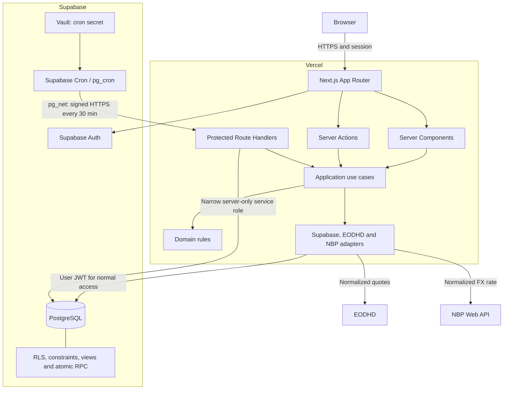

# Technology Stack Recommendation & Architecture Validation

## 1. Executive Recommendation

> **Recommended stack: Next.js 16 App Router + React 19 + strict TypeScript, deployed on Vercel Hobby, with Supabase PostgreSQL/Auth/RLS.**

Use a modular monolith and one application runtime: Vercel's Node.js runtime.  
Use Server Components for reads, Server Actions for UI mutations, and Route Handlers only for integration boundaries.  
Keep Supabase Cron, but have it call a protected Next.js Route Handler directly; do not implement Supabase Edge Functions in the MVP.  
Use PostgreSQL functions only where atomic multi-table writes are required.  
Use EODHD behind a small provider adapter, with NBP behind a separate FX adapter.  
Use email/password for the manually provisioned single account; magic links would introduce an unnecessary SMTP dependency.  
The application can run at **$0/month infrastructure cost**, excluding market data and an optional domain.  
The likely first infrastructure upgrade is Supabase Pro for backups and guaranteed non-pausing—not performance.

The PRD's general direction is sound. The important simplification is removing the Deno Edge Function runtime.

## 2. Final Stack

| Layer                 | Technology                                                                        | Purpose                                                | Why this choice                                                                                      |
| --------------------- | --------------------------------------------------------------------------------- | ------------------------------------------------------ | ---------------------------------------------------------------------------------------------------- |
| Framework             | Next.js 16 App Router, React 19                                                   | UI, server rendering, mutations, integration endpoints | Supplies the backend capabilities the application actually needs without a separate service          |
| Language              | TypeScript 5, `strict`                                                            | Entire application codebase                            | One language across UI, application, domain and integrations                                         |
| Runtime               | Vercel Node.js                                                                    | All application and synchronization logic              | Full npm/Node compatibility and no Node/Deno duplication                                             |
| Styling               | Tailwind CSS 4 + CSS variables                                                    | Dense dashboard styling and design tokens              | Fast implementation while preserving the existing custom visual architecture                         |
| UI primitives         | Selective shadcn/ui components backed by Radix                                    | Dialogs, menus, popovers, tabs, command palette        | Accessible primitives delivered as editable source code, not a prescribed SaaS theme                 |
| Tables                | TanStack Table                                                                    | Watchlist, opportunities and monitoring tables         | Sorting, filtering, column control and dense financial layouts are concrete requirements             |
| Forms                 | Native forms plus React Hook Form for complex forms                               | Notes, price levels, monitoring                        | Avoids form machinery for trivial actions while supporting complex monitoring forms                  |
| Validation            | Zod at TypeScript boundaries; PostgreSQL constraints                              | Input, provider payload and invariant validation       | Shared browser/server schemas, with hard persistence invariants enforced by the database             |
| Database              | Supabase PostgreSQL                                                               | Canonical and historical application data              | Correct fit for relationships, immutable history, numeric prices, transactions and dashboard queries |
| Database access       | `@supabase/supabase-js`, generated types, SQL migrations and narrow RPC functions | Typed queries and atomic persistence                   | Avoids a second schema source and works naturally with Auth/RLS                                      |
| Authentication        | Supabase Auth, email/password, one manually created account                       | Private login                                          | No public registration and no dependency on transactional email for normal sign-in                   |
| Authorization         | PostgreSQL RLS plus explicit grants                                               | Owner-only access                                      | Database-level defense in depth even if an endpoint or browser integration is misconfigured          |
| Backend reads         | React Server Components calling application query services                        | Dashboard and detail reads                             | No internal HTTP round trip                                                                          |
| Backend mutations     | Next.js Server Actions                                                            | Authenticated UI commands                              | Good fit for form-driven mutations and revalidation                                                  |
| Integration endpoints | Next.js Route Handlers                                                            | Cron entry point and future versioned import API       | Explicit HTTP boundary only where HTTP is actually required                                          |
| Transactions          | Narrow PostgreSQL functions invoked through RPC                                   | Monitoring + thesis + current status atomic writes     | Supabase Data API calls do not otherwise span one transaction                                        |
| Scheduled jobs        | Supabase Cron/`pg_cron` + `pg_net` → protected Vercel Route Handler               | 30-minute synchronization trigger                      | Preserves frequent free-tier scheduling while executing all business code in Node                    |
| Market data           | EODHD adapter                                                                     | GPW and USA quotes                                     | One provider covers both markets; mapping remains replaceable                                        |
| FX                    | NBP Web API adapter                                                               | USD/PLN reference rate                                 | Free official source with simple daily requirements                                                  |
| Testing               | Vitest, selective Testing Library, Supabase/pgTAP database tests, Playwright      | Domain, RLS, integration and critical E2E verification | Covers high-risk behavior without a large test platform                                              |
| Hosting               | Vercel Hobby                                                                      | Next.js deployment                                     | Appropriate for a personal, non-commercial application                                               |
| CI/CD                 | GitHub Actions + Vercel Git integration                                           | Checks and deployment                                  | Simple, familiar and initially free                                                                  |
| Observability         | `sync_runs`, Vercel/Supabase logs, structured application logs                    | Operational diagnosis                                  | Persistent job history compensates for short free-tier log retention                                 |
| Backups               | Supabase CLI/`pg_dump` to independent encrypted storage                           | Historical research preservation                       | Supabase Free does not include automatic downloadable backups                                        |

## 3. Architecture Decision

### Next.js versus Vite

Next.js wins for this application, but not because server rendering is inherently required.

A Vite SPA would be slightly simpler for a purely browser-based CRUD tool. This application, however, also needs:

- secret-bearing market-data calls;
- scheduled synchronization;
- protected manual refresh;
- server-side Auth session validation;
- atomic application commands;
- a future versioned JSON import endpoint.

With Vite, those responsibilities would still require Supabase Edge Functions or another serverless backend. Next.js therefore removes an entire separately configured backend runtime. Server Components also permit direct reads without creating REST endpoints for the UI. This matches current Next.js guidance: Server Components cover normal server reads, Server Actions cover frontend mutations, and Route Handlers are appropriate for external HTTP boundaries. [Next.js backend-for-frontend guidance](https://nextjs.org/docs/app/guides/backend-for-frontend)

### Material changes from the PRD proposal

| Change                                                                           | Why                                                                   | Requirement improved                                                | Trade-off                                                                                                       |
| -------------------------------------------------------------------------------- | --------------------------------------------------------------------- | ------------------------------------------------------------------- | --------------------------------------------------------------------------------------------------------------- |
| Remove Supabase Edge Functions from MVP                                          | They duplicate application logic in Deno                              | Simpler maintenance, one language/runtime, easier Codex development | Scheduled execution crosses from Supabase Cron to Vercel over authenticated HTTPS                               |
| Retain Supabase Cron but call Vercel directly                                    | Vercel Hobby's native cron can run only once daily                    | Keeps required 30-minute synchronization at $0 infrastructure cost  | Requires a protected internal endpoint and monitoring of the cross-service call                                 |
| Replace most internal REST endpoints with direct server reads and Server Actions | Internal HTTP adds contracts and round trips without another consumer | Less boilerplate and fewer duplicated validation paths              | UI operations are coupled to the Next.js application; future external consumers receive separate versioned APIs |
| Use email/password initially                                                     | Magic links depend on email delivery on every new login               | Reliable single-user access without configuring SMTP                | User must protect one strong password; optional TOTP can be added later                                         |
| Use React Hook Form selectively                                                  | Notes and archive actions do not need a full form abstraction         | Smaller client-side footprint and simpler code                      | Two form patterns must be documented clearly                                                                    |

Supabase's default email service is limited to two messages per hour, has no delivery SLA and is not intended for production authentication. That makes magic-link-only authentication a poor default unless custom SMTP is added. [Supabase SMTP guidance](https://supabase.com/docs/guides/auth/auth-smtp)

### Implementation-oriented architecture



Dependency direction:

```text
UI
  → Application use cases
    → Domain types and rules
      ← Infrastructure adapters implement required ports
```

The domain must not import Next.js, Supabase SDKs or provider response types.

## 4. Runtime Responsibility Matrix

`—` under Edge Function means that runtime is not deployed in MVP.

| Responsibility                 |                         Browser |                                 Next.js / Vercel |                                               Supabase Postgres | Supabase Edge Function |                  External API |
| ------------------------------ | ------------------------------: | -----------------------------------------------: | --------------------------------------------------------------: | ---------------------: | ----------------------------: |
| Render pages and navigation    |                  Interactive UI |                                 Server rendering |                                                     Data source |                      — |                             — |
| Dashboard read                 |                  Filters in URL |                 Server Component → query service |                                                 View/query, RLS |                      — |                             — |
| Form validation                | Immediate shared Zod validation |                     Authoritative Zod validation |                                                     Constraints |                      — |                             — |
| Add/archive stock              |                   Submit action |                           Server Action/use case |                                       Transactional persistence |                      — |        Instrument search only |
| Create monitoring              |                Form interaction |                  Server Action/domain validation | Atomic RPC inserts monitoring/thesis and updates current status |                      — |                             — |
| Add/edit price level           |                Form interaction |                                    Server Action |                                     Constraints and persistence |                      — |                             — |
| Notes and pinning              |             Local pending state |                                    Server Action |                                                 Persistence/RLS |                      — |                             — |
| Authentication                 |                      Login form |        Session verification and route protection |                                 Auth-owned identity/RLS context |                      — |         Supabase Auth service |
| Authorization                  |            No trusted decisions |                        Check authenticated owner |                            Final enforcement through grants/RLS |                      — |                             — |
| Schedule synchronization       |                               — |                                                — |                            `pg_cron` schedules `pg_net` request |                      — |                             — |
| Execute synchronization        |         Optional manual trigger | Protected Route Handler and application use case |                        Advisory lock, quote upsert, `sync_runs` |                      — |               Supplies quotes |
| GPW/USA market-window decision |                               — |                              Node domain service |                                       Last successful run/state |                      — |     Optional trading calendar |
| Retry and throttling           |                               — |                                 Provider adapter |                                            Run/checkpoint state |                      — |           Returns `429`/`5xx` |
| USD/PLN synchronization        |                               — |                          Same scheduled use case |                              Latest FX and snapshot persistence |                      — |             NBP supplies rate |
| Provider-symbol normalization  |        Display canonical ticker |                Adapter maps provider instruments |                                         Stores verified mapping |                      — |          Uses provider symbol |
| Future JSON import             |                 Draft/review UI |            Versioned Route Handler and use cases |                                    Draft plus atomic commit RPC |                      — | Future AI client submits JSON |
| Operational history            |             Sync status display |                          Structured log emission |                                          Persistent `sync_runs` |                      — |                             — |

Supabase Cron supports scheduled SQL or HTTP requests and uses `pg_cron`; the service recommends no more than eight concurrent jobs and ten minutes per job. This project needs only one scheduler tick. [Supabase Cron documentation](https://supabase.com/docs/guides/cron)

## 5. Technology Decisions

### Next.js App Router

**USE**

Reason: the application needs server-only integrations and authenticated mutations. Server Components avoid internal REST calls, while Route Handlers provide the required cron and future import boundaries.

### Vite + React SPA

**DO NOT USE for MVP**

Reason: it would still need a separately deployed backend for provider secrets, jobs and external endpoints. That is not simpler for this PRD.

### Next.js Server Components

**USE for reads**

Reason: dashboard, watchlist and stock detail can query application services on the server and send only required data to interactive components.

### Next.js Server Actions

**USE for UI mutations**

Reason: add/archive stock, monitoring, levels, notes and settings are first-party form commands.

Every Server Action must authenticate and authorize independently; hiding a button is not authorization.

### Next.js Route Handlers

**USE selectively**

Use for:

- `/api/internal/market-sync`;
- provider search if it must be called interactively from a client component;
- future `/api/v1/monitoring-imports`;
- health endpoints that expose no private data.

Do not reproduce all Server Actions as REST endpoints.

### Supabase Edge Functions

**DO NOT USE in MVP**

Reason: they introduce Deno, separate dependency management, separate logs and a second location for business logic. No identified requirement needs edge execution.

### Supabase PostgreSQL

**USE**

Reason: relationships, append-only history, revisions, numeric values, RLS, transactional commands, indexes and dashboard aggregations all favor relational storage.

Use:

- SQL migrations as the schema authority;
- generated Supabase TypeScript types;
- views or SQL functions for dashboard aggregation;
- narrow transactional RPC functions;
- `numeric`, UTC timestamps and explicit constraints.

### ORM

**DO NOT USE in MVP**

Reason: Prisma or Drizzle would add another schema/migration abstraction while the project already depends on PostgreSQL-specific RLS, views, policies, functions and constraints.

Trade-off: some application queries will be less fluent than ORM queries. At this scale, generated Supabase types and feature-specific query modules are sufficient.

### Supabase Auth

**USE with email/password**

Configuration:

- create the sole account manually;
- disable public sign-up;
- use the supported Supabase SSR cookie integration;
- require a strong password stored in a password manager;
- optionally add TOTP after MVP.

Do not build invitations, organizations, roles or user administration.

### Row Level Security

**USE**

RLS remains valuable for one user because it protects the data at the final persistence boundary. Normal user requests should use the user's session/JWT and satisfy `user_id = auth.uid()`. The service-role key bypasses RLS and must be restricted to the cron adapter and administrative operations. [Supabase RLS guidance](https://supabase.com/docs/guides/database/postgres/row-level-security)

Also use explicit grants:

- no anonymous access to application tables;
- authenticated owner receives only required operations;
- immutable historical tables do not receive ordinary update/delete privileges;
- reference and quote tables are authenticated-read, server-write.

### Supabase Cron + Vercel Route Handler

**USE**

Create one 30-minute scheduler tick on weekdays across a broad UTC window. The Node use case decides whether GPW, USA and/or FX are due.

This avoids separate jobs for every market and handles Warsaw/US DST differences safely. Each run should:

1. acquire a PostgreSQL advisory lock;
2. create `sync_runs`;
3. load only active provider-mapped instruments;
4. call the provider in bounded batches;
5. validate and normalize responses;
6. upsert only when `incoming.asOf > stored.asOf`;
7. write partial failures;
8. release the lock and finish the run.

Vercel Hobby's own cron is not suitable because it permits only daily schedules, with up to ±59 minutes timing precision. [Vercel Cron limits](https://vercel.com/docs/cron-jobs/usage-and-pricing)

### Market-data abstraction

**USE one narrow provider port**

Minimum useful contracts:

```text
MarketDataProvider
  search(query, market)
  getQuotes(providerInstruments)

FxRateProvider
  getUsdPln(date?)

ProviderInstrument
  stockId
  provider
  providerSymbol

NormalizedQuote
  stockId
  price
  currency
  previousClose?
  dayChangePct?
  asOf
  receivedAt
  provider
```

Persist mappings such as:

```text
Internal: GPW + PZU
EODHD:   PZU.WAR
Future:  PZU.WA
```

The suffix belongs only in `stock_provider_symbols` and the adapter.

EODHD currently lists WAR/XWAR coverage and an All World Extended plan at $29.99/month for delayed/intraday access, but the eight-symbol provider spike remains mandatory before purchase. [EODHD WAR coverage](https://eodhd.com/exchange/WAR), [EODHD pricing](https://eodhd.com/pricing-quantpedia/)

### NBP

**USE for daily USD/PLN**

Reason: it is a public official API and monitoring stores the actual FX rate used, so no later exchange-rate change rewrites history. [NBP Web API](https://api.nbp.pl/en.html)

Do not treat the NBP daily fixing as an intraday tradable rate.

### Tailwind CSS and design tokens

**USE**

Tailwind should express the existing visual architecture, not generate a generic card-heavy theme. Put color, spacing, density, focus, typography and semantic status values in CSS variables.

### shadcn/ui and Radix

**USE selectively**

Use accessible behavior from dialogs, popovers, menus, tabs, tooltips and command primitives. Copy only needed components into the repository and restyle them.

Do not adopt a complete prebuilt dashboard theme.

### TanStack Table

**USE**

Reason: dense sorting, filtering and column-based tables are central to the product. Keep filter state in URL query parameters where navigation/history benefits.

### React Hook Form

**USE selectively**

Use for monitoring, status editing and multi-row price-level forms. Use native forms and Server Actions for login, a short note, archive/restore and refresh commands.

### Zod

**USE**

Apply one shared schema at browser and server boundaries. Provider responses get separate adapter-owned schemas.

Database constraints should repeat only hard persistence invariants:

- positive values;
- score ranges;
- uniqueness;
- valid currency/status dictionaries;
- foreign keys;
- immutability rules.

### TanStack Query, Redux and Zustand

**DO NOT USE in MVP**

Server Components, Server Actions, URL state, component state and React transitions are sufficient. Add a client cache only if later polling or offline behavior produces a demonstrated need.

### Testing

**USE a risk-focused stack**

- Vitest: price-distance mathematics, freshness, ticker normalization, scheduling decisions, Zod schemas and application services.
- Supabase/pgTAP: RLS, grants, append-only history, constraints and atomic monitoring RPC.
- Testing Library: only interactive components with meaningful behavior.
- Playwright: one primary end-to-end journey plus provider-outage and unauthorized-user cases.

## 6. Technologies Explicitly Rejected

| Technology                    | Why it is unnecessary in MVP                                                          |
| ----------------------------- | ------------------------------------------------------------------------------------- |
| Microservices                 | One user and one coherent domain do not justify distributed deployment or contracts   |
| Supabase Edge Functions       | Duplicate Deno runtime without an edge-latency requirement                            |
| Vercel Cron                   | Hobby cannot meet 30-minute scheduling                                                |
| Separate ASP.NET/Node backend | Next.js already supplies the required server boundary                                 |
| Kubernetes or containers      | No continuously running workload or scaling requirement                               |
| Redis                         | No shared ephemeral state or cache is needed                                          |
| Message broker                | A 30-minute idempotent job with 200 instruments does not require event infrastructure |
| Background worker server      | Serverless batches fit the workload                                                   |
| GraphQL                       | No heterogeneous public clients or flexible external query surface                    |
| WebSockets/Supabase Realtime  | Delayed prices and ordinary page refreshes satisfy the PRD                            |
| Search engine                 | PostgreSQL `ILIKE` is sufficient for 200 stocks                                       |
| Prisma/Drizzle ORM            | Duplicates a SQL-first schema centered on RLS, policies and stored functions          |
| Redux/Zustand                 | No complex cross-page client state                                                    |
| TanStack Query                | No frequent client polling or complex server-cache synchronization                    |
| Sentry at launch              | Persistent job history and platform logs are sufficient initially                     |
| Feature-flag platform         | One owner can deploy or configure features directly                                   |
| Separate charting library     | MVP explicitly excludes charts                                                        |
| AI SDK/LLM orchestration      | AI automation is outside MVP                                                          |
| Email provider                | No alerts and no magic-link dependency in MVP                                         |

## 7. Free-Tier / Cost Assessment

| Service                   | MVP plan               |        Expected cost | Relevant limit                                                                                                      | Upgrade trigger                                                                         |
| ------------------------- | ---------------------- | -------------------: | ------------------------------------------------------------------------------------------------------------------- | --------------------------------------------------------------------------------------- |
| Vercel                    | Hobby                  |             $0/month | Personal/non-commercial use; 1M function invocations, 4 CPU-hours; 1-hour runtime logs; 300-second Function maximum | Commercial use, compute exhaustion, longer logs or job duration                         |
| Supabase                  | Free                   |             $0/month | 500 MB database; 5 GB egress; possible pause after low activity for seven days; one-day logs; no automatic backups  | History becomes critical, project pausing is unacceptable or database approaches 500 MB |
| Supabase Auth             | Included in Free       |             $0/month | 50,000 MAU—irrelevant for one user                                                                                  | No scale-based upgrade expected                                                         |
| Supabase Cron             | Included with database |             $0/month | Keep jobs below ten minutes and avoid high concurrency                                                              | Not expected at this workload                                                           |
| GitHub repository/Actions | Free                   |             $0/month | 2,000 Actions minutes/month for private repositories                                                                | Excessive CI frequency or large E2E matrix                                              |
| NBP API                   | Public API             |             $0/month | Daily reference data; not an SLA-backed intraday feed                                                               | Only if a different FX definition becomes required                                      |
| EODHD manual/free mode    | Free                   |             $0/month | 20 API calls/day—insufficient for automatic 30-minute monitoring                                                    | Enable automatic price synchronization                                                  |
| EODHD All World Extended  | Paid provider          | $29.99/month monthly | 100,000 calls/day and 1,000/minute advertised; coverage still requires verification                                 | First likely paid external service                                                      |
| Optional domain           | Registrar              |  Roughly $10–20/year | Not required; Vercel domain works                                                                                   | Vanity URL desired                                                                      |

Current Supabase Free limits include a 500 MB database, no automatic backups and pausing after one week of inactivity; Pro starts at $25/month and adds seven days of daily backups. [Supabase pricing](https://supabase.com/pricing) Vercel Hobby is explicitly intended for personal, non-commercial projects. [Vercel Hobby plan](https://vercel.com/docs/plans/hobby) GitHub Free includes 2,000 Actions minutes per month. [GitHub Actions allowance](https://docs.github.com/en/billing/reference/product-usage-included)

At this workload, Auth, API request, function invocation, bandwidth and realtime limits do not matter. Realtime and Supabase Edge Functions are not used.

The 500 MB database limit is unlikely to be the first capacity problem. The main growth sources are long notes, monitoring text/JSON and EOD history—not the latest quote table. Database size should nevertheless be measured monthly because indexes and PostgreSQL overhead matter.

### Minimum monthly infrastructure cost

**$0/month**, excluding:

- market-data subscription;
- optional domain;
- independent backup storage if existing encrypted storage is unavailable.

### Expected operating cost with automatic 30-minute prices

**Approximately $29.99/month**, entirely attributable to EODHD after the provider spike.

If end-of-day prices are accepted instead, the current EODHD All World plan is $19.99/month.

### Expected first paid upgrade

1. **First paid service overall:** EODHD All World Extended, approximately $29.99/month.
2. **First application-infrastructure upgrade:** Supabase Pro, $25/month, when research history becomes irreplaceable or pausing is unacceptable.
3. **Vercel Pro:** only later if Hobby terms no longer apply, usage is exceeded, or moving the 30-minute scheduler to Vercel becomes desirable. Current Pro pricing starts at $20/month. [Vercel pricing](https://vercel.com/pricing)

### Independent backup requirement

Before this application becomes the only copy of investment research:

- keep migrations and seeds in Git;
- create at least weekly logical database dumps;
- encrypt them and store them outside Supabase;
- retain several dated generations;
- perform a restore test at least quarterly;
- document Auth recreation and secret rotation separately.

Supabase explicitly recommends regular CLI database dumps and off-site storage for Free projects. [Supabase backup guidance](https://supabase.com/docs/guides/platform/backups)

## 8. Risks and Trade-offs

| Risk                                         | Impact                                                 | Practical mitigation                                                                                                                     |
| -------------------------------------------- | ------------------------------------------------------ | ---------------------------------------------------------------------------------------------------------------------------------------- |
| Incomplete or incorrect GPW coverage         | Wrong/missing prices undermine the core workflow       | Execute the eight-symbol spike before purchase; preserve manual instruments/prices; display provider and `as of` everywhere              |
| Supabase Free pausing                        | App may need manual resume after a low-activity period | Do not assume cron guarantees activity; show health state; upgrade to Pro once uninterrupted availability matters                        |
| No Free automatic backup                     | Permanent loss of research history                     | Weekly encrypted logical dump, multiple generations, quarterly restore test; upgrade to Pro before data becomes irreplaceable            |
| Cross-service cron invocation fails          | A synchronization window may be missed                 | Signed endpoint, persistent `sync_runs`, next-tick retry, stale-data UI and manual refresh                                               |
| Vercel Function reaches 300 seconds          | A large or slow provider batch may terminate           | Bound concurrency, batch requests, checkpoint progress, stop below four minutes and resume on next tick                                  |
| Duplicate/overlapping syncs                  | Provider waste or older quote overwriting newer data   | Advisory lock, idempotent run key and conditional upsert by `as_of`                                                                      |
| Provider symbol changes or multiple listings | Incorrect company may be monitored                     | Persistent verified mapping, market/MIC/ISIN metadata and user confirmation during add-stock flow                                        |
| DST, holidays and different sessions         | Missing or unnecessary price calls                     | Broad scheduler window; market-aware Node decision using `Europe/Warsaw` and exchange calendars                                          |
| Service-role leakage                         | Complete RLS bypass                                    | Never expose it to the browser; isolate its construction to the sync adapter; rotate it and avoid logging configuration                  |
| Vendor lock-in                               | Supabase-specific code complicates migration           | Standard SQL migrations, portable domain types, no Edge Functions, provider ports and limited Supabase imports in infrastructure modules |
| Historical records accidentally changed      | Loss of decision provenance                            | Append-only grants/policies, correction through `supersedes_id`, atomic RPC and database tests                                           |

Vercel Hobby's current Function maximum is 300 seconds with Fluid Compute, which is adequate but must be treated as a hard boundary. [Vercel Function duration](https://vercel.com/docs/functions/configuring-functions/duration)

## 9. MVP Stack vs Future Stack

### Build now

- Next.js App Router modular monolith.
- Strict TypeScript.
- Tailwind CSS and CSS-variable design tokens.
- Selective shadcn/Radix primitives.
- TanStack Table.
- React Hook Form only for complex forms.
- Zod plus PostgreSQL constraints.
- Supabase PostgreSQL, Auth and RLS.
- SQL migrations, generated Supabase types and narrow transactional RPC.
- Server Components, Server Actions and protected Route Handlers.
- Supabase Cron calling a single Vercel synchronization endpoint.
- EODHD and NBP adapters.
- Manual-data fallback.
- Vitest, small pgTAP/RLS suite and one critical Playwright journey.
- `sync_runs`, structured logs and independent backups.

### Add only when required

- JSON import Route Handler, draft review and idempotency in V1.
- Fundamental provider and `fundamental_snapshots` after coverage testing.
- Chart library when historical charts enter scope.
- Email provider when alerts or magic-link authentication are actually adopted.
- TOTP if the risk assessment justifies additional login protection.
- Second market-data provider after measured EODHD quality failures.
- Automated scheduled exports after the manual backup procedure is proven.
- Sentry if platform logs and `sync_runs` fail to diagnose real incidents.
- TanStack Query only for demonstrated client polling/cache requirements.
- Queue or durable workflow only if work repeatedly exceeds the five-minute serverless limit.
- Portfolio-specific entities only in V2.
- Redis only if a concrete shared-cache or rate-limit problem appears.

## 10. Final Stack Contract

```text
FRONTEND:
Use Next.js 16 App Router with React 19 and strict TypeScript.
Use Server Components by default and Client Components only for interaction.
Use Tailwind CSS 4 with CSS-variable design tokens.
Use selective shadcn/ui and Radix primitives without adopting a generic theme.
Use TanStack Table for dense financial tables.
Store filter and sort state in URL query parameters when navigation should preserve it.

APPLICATION LAYER:
Implement a modular monolith.
Organize code by UI → application use cases → domain → infrastructure adapters.
Use Server Components for internal reads.
Use Server Actions for authenticated UI mutations.
Use Route Handlers only for scheduled jobs, external integrations and future versioned APIs.
Do not duplicate use-case logic between Server Actions and Route Handlers.
Use small provider interfaces and feature query modules; do not create interfaces for every table.

DATABASE:
Use Supabase PostgreSQL as the only durable data store.
Use SQL migrations as the schema authority and generate TypeScript database types.
Use numeric values for money and UTC timestamptz values for time.
Use constraints, foreign keys, indexes and partial indexes.
Use SQL views/functions for dashboard aggregation where useful.
Use narrow RPC functions for atomic monitoring/thesis/status writes.
Make monitoring and thesis history append-only; corrections create new revisions.
Do not introduce an ORM or document database.

AUTH:
Use Supabase Auth with one manually provisioned email/password account.
Disable public registration.
Use supported SSR session handling and verify the session in every server entry point.
Use RLS and explicit grants on all exposed tables.
Normal user operations must use the user JWT and RLS.
The service-role key is server-only and limited to synchronization/administrative adapters.
Magic links and custom SMTP are not part of MVP.
Organizations, invitations and role-management UI are prohibited.

BACKGROUND JOBS:
Use one Supabase Cron/pg_cron scheduler tick every 30 minutes in a broad weekday window.
Use pg_net to call a protected Next.js Route Handler on Vercel.
Store the shared cron secret in Supabase Vault and Vercel environment variables.
Execute all synchronization logic in the Vercel Node.js runtime.
Use advisory locks, sync_runs, bounded batches, conditional quote upserts and partial-success reporting.
Do not use Vercel Cron for the 30-minute MVP schedule.
Do not deploy Supabase Edge Functions.

EXTERNAL DATA:
Use EODHD as the initial GPW+USA MarketDataProvider only after the required symbol-coverage spike.
Persist provider symbols separately from canonical market+ticker identity.
Normalize every provider response before it reaches application or domain code.
Use the official NBP API through a separate FxRateProvider.
Support manual instruments and manual prices when no provider is configured or available.
Never expose provider keys or raw provider payloads to the browser.

VALIDATION:
Use shared Zod schemas for browser/server input where interactive validation is useful.
Revalidate authoritatively at every Server Action and Route Handler.
Use adapter-owned Zod schemas for external API responses.
Repeat only hard persistence invariants as PostgreSQL constraints.
Sanitize rendered Markdown and never render user/provider HTML directly.

TESTING:
Use Vitest for domain rules, calculations, schemas and application services.
Use a small Supabase/pgTAP suite for RLS, grants, constraints, immutability and transactional RPC.
Use Testing Library only for behavior-heavy UI.
Use Playwright for:
login → add stock → add price level → create monitoring
→ view dashboard → archive stock → restore stock.
Also test unauthorized access, provider outage and stale-price behavior.

DEPLOYMENT:
Use a private GitHub repository.
Use GitHub Actions for lint, typecheck, unit tests, database tests and build.
Use Vercel Hobby for the personal non-commercial Next.js deployment.
Use Supabase Free for initial development and MVP.
Apply reviewed production migrations through a controlled CI workflow.
Never connect preview deployments to production with a production service-role key.

OBSERVABILITY:
Persist every synchronization attempt in sync_runs.
Use structured logs without secrets or full sensitive payloads.
Use Vercel and Supabase logs for short-term diagnosis.
Show last successful run, failures and quote freshness in the application.
Maintain independent encrypted logical database backups and test restoration.
Do not add Sentry until real diagnostic needs justify it.

DO NOT INTRODUCE:
Supabase Edge Functions, Vercel Cron for frequent sync, Vite SPA,
microservices, separate ASP.NET/Node backend, ORM, Redis, queues,
message brokers, GraphQL, WebSockets, Realtime subscriptions,
Redux, Zustand, TanStack Query, Kubernetes, background servers,
search engines, feature-flag services, charting, email infrastructure,
AI orchestration or portfolio infrastructure during MVP.
```

This recommendation completes the stack decision only; no scaffolding, UI code or database migrations have been created.
